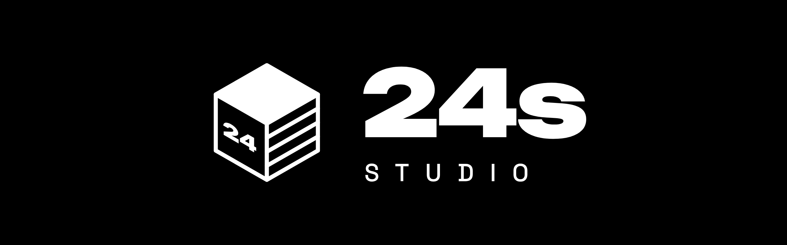
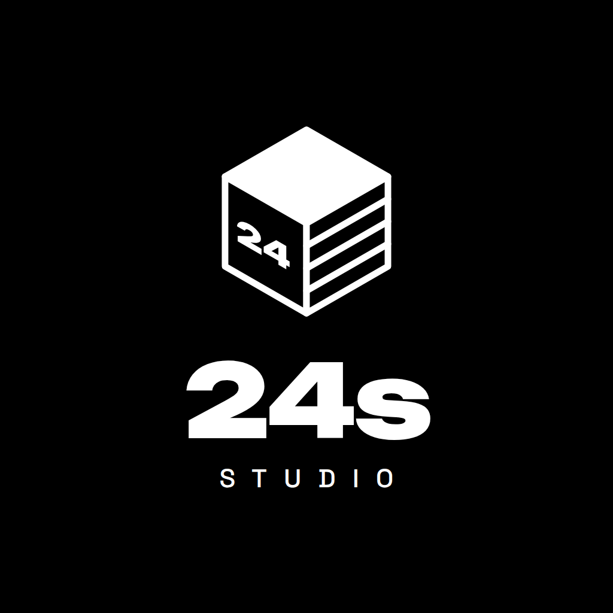

  

  <b>Estudio independiente de videojuegos en Roblox</b> 
  Cinco amigos creando experiencias para jugar, compartir y volver a jugar.

  <a href="[ENLACE A LA COMUNIDAD EN ROBLOX]">Comunidad en Roblox</a> ·
  <a href="[ENLACE AL DISCORD]">Discord</a> ·
  <a href="[ENLACE A REDES SOCIALES]">Redes sociales</a>

---

## Quiénes somos

**24s Studio** es un equipo de desarrollo que crea juegos para Roblox. Trabajamos juntos en cada proyecto, desde la idea hasta el lanzamiento, y entre todos decidimos cómo funciona cada juego.

## El equipo

| | Rol | Se encarga de |
| :-- | :-- | :-- |
| **Ojeda** | Scripter | Programación y sistemas del juego |
| **Valen** | Scripter | Programación y sistemas del juego |
| **Mario** | Builder | Mapas, modelos e iluminación |
| **Jesu** | Diseñador de interfaces | Menús, botones y pantallas |
| **Dani** | Marketing | Comunidad, redes sociales y lanzamientos |

## Nuestros juegos

| Juego | Estado | Jugar |
| :-- | :-- | :-- |
| [NOMBRE DEL PRIMER JUEGO] | En desarrollo | Próximamente |

## Cómo trabajamos

- Desarrollamos en **Roblox Studio** con Team Create, todos en el mismo proyecto.
- Organizamos las tareas en el tablero de **GitHub Projects** de la organización.
- Nos comunicamos y compartimos avances en **Discord**.

---

   
  © 2026 24s Studio

